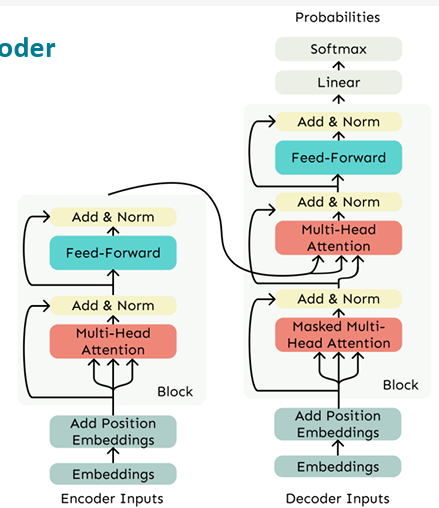

# Transformer Architectures
Transformer architectures can be categorized based on how attention is applied to input and output sequences, leading to encoder-only, decoder-only, and encoder–decoder designs.

## Decoder

The Transformer Decoder consists of a stack of identical Transformer Decoder Blocks. Each block contains the following components in sequence:

- Masked self-attention: Allows each position to attend only to previous positions in the sequence, enforcing auto-regressive generation  
- Add and norm: Residual connection followed by layer normalization  
- Feed-forward network (FFN): A position-wise fully connected feed-forward network  
- Add and norm: Another residual connection and layer normalization  

This structure ensures that the decoder generates tokens autoregressively, relying solely on previously generated outputs.

Decoder models use only the decoder of a Transformer model. At each stage, for a given word, the attention layers can only access the words positioned before it in the sentence. These models are often called auto-regressive models.

The pretraining of decoder models usually revolves around predicting the next word in the sentence.

These models are best suited for tasks involving text generation.

## Encoder

The Transformer Encoder differs by enabling bidirectional context, analogous to bidirectional RNNs. This is achieved by removing the causal masking in the self-attention mechanism, allowing each token to attend to all tokens in the sequence.

Each encoder block consists of:

- Self-attention (unmasked): Enables full bidirectional context  
- Add and norm  
- Feed-forward network  
- Add and norm  

This allows the encoder to build comprehensive contextual representations of the input sequence.

The pretraining of these models usually revolves around corrupting a given sentence (for instance, by masking random words) and tasking the model with reconstructing the original sentence.

Encoder models are best suited for tasks requiring an understanding of the full sentence, such as sentence classification, named entity recognition (and more generally word classification), and extractive question answering.

 
## Encoder-Decoder

For sequence-to-sequence tasks such as machine translation, the source sentence is encoded with a bidirectional model, while the target sentence is generated with a unidirectional model. The Transformer encoder-decoder architecture formalizes this approach by combining:

- A standard Transformer encoder to process the entire source sequence  
- A modified Transformer decoder that, in addition to masked self-attention, performs cross-attention over the encoder outputs  

### Cross-attention.  
Cross-attention differs from self-attention in that the keys and values come from the encoder output, while the queries come from the decoder input states.

Formally, let

$$
h_1, \ldots, h_n \in \mathbb{R}^d
$$

be the encoder output vectors, and

$$
z_1, \ldots, z_m \in \mathbb{R}^d
$$

be the decoder input vectors. Then the keys and values drawn from the encoder are

$$
K = W_k h_i, \quad V = W_h h_i
$$

and the queries are

$$
Q = W_z z_j
$$

where $W_k$, $W_h$, and $W_z$ are learned projection matrices.

Cross-attention allows each decoder state to selectively retrieve information from the entire encoded source sequence.

The decoder uses these queries to attend to the encoder memory via the cross-attention mechanism, enabling selective focus on relevant parts of the source sequence when generating each target token.

The pretraining of these models can take different forms, but it often involves reconstructing a sentence for which the input has been corrupted. For example, the pretraining of the T5 model replaces random spans of text (which may contain multiple words) with a single mask token, and the task is to predict the text that the mask token replaces.

Sequence-to-sequence models are best suited for tasks involving generating new sentences conditioned on an input, such as summarization, translation, or generative question answering.

 
## Limitations and Areas for Improvement in the Transformer

Despite its success, the Transformer architecture has some notable limitations that motivate ongoing research:

- Quadratic computational complexity in self-attention:   The self-attention mechanism requires computing interactions between all pairs of tokens in the input sequence, resulting in computation and memory complexity of $O(n^2 d)$, where $n$ is the sequence length and $d$ is the dimensionality of the embeddings. Specifically, the attention matrix $QK^\top \in \mathbb{R}^{n \times n}$ encodes all pairwise interactions, which becomes prohibitive for very long sequences.For example, with $n = 512$, the number of pairwise interactions exceeds $262{,}000$. For sequences with $n \ge 50{,}000$, this quadratic growth becomes infeasible. In contrast, recurrent models have computational complexity that grows linearly with sequence length.

- Position representations:  Transformers typically use simple absolute positional encodings, such as sinusoidal embeddings, to inject information about token order. However, it remains an open question whether absolute indices are the optimal way to represent positional information. Alternatives such as relative position encodings and syntax-aware position embeddings have been proposed to capture dependencies more naturally and improve model performance.
