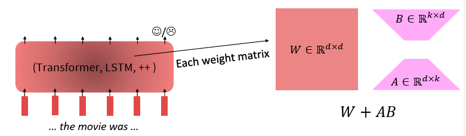

## Fine-tuning and Parameter-Efficient Adaptation

The standard adaptation strategy for pretrained language models involves updating all model parameters on a task-specific dataset. This approach is typically effective but computationally expensive.

- Method: Unfreeze and update all weights during training
- Pros:
    - Strong performance across tasks
    - Deep integration of task-specific signal
- Cons:
    - High memory and compute cost
    - Risk of overfitting, especially in low-resource settings
    - Each task or domain requires storing a full model copy

## Parameter-Efficient Fine-tuning (PEFT)

PEFT methods aim to adapt large language models by updating only a small fraction of the parameters, or by introducing new lightweight modules, while keeping the backbone frozen.

- Reduce training time and GPU memory usage
- Support multi-task and multi-user deployment
- Preserve generalization by avoiding full weight drift

## Prompt Tuning

Prompt tuning learns a set of continuous embeddings (soft prompts) that are prepended to the input. The rest of the model remains frozen.

- Method: Optimize only a small set of input-level vectors
- Pros:
    - Extremely lightweight (less than 0.1% of total parameters)
    - Easy to implement
- Cons:
    - Unstable for small models
    - Performance gap compared to other PEFT methods on many tasks

## Prefix Tuning

Prefix tuning prepends trainable vectors to the key and value matrices of each Transformer layer, guiding attention.

- Method: Learn prefix vectors while freezing the pretrained model
- Pros:
     - Efficient (approximately 1–2% of total parameters)
    - Stronger performance than prompt tuning on many tasks
    - Task-specific prefixes allow batched inference across tasks
- Cons:
    - More intrusive implementation than prompt tuning

## Adapter Tuning

Adapters are small bottleneck layers inserted within each Transformer block. Only adapter parameters are trained.

- Method: Add adapter layers after attention and after the feed-forward network, while freezing the base model
- Pros:
     - Competitive performance on many NLP tasks
     - Modular design allows composition for multi-task learning
- Cons:
    - Slightly larger parameter footprint than other PEFT methods
    - Requires architecture modification

## Low-Rank Adaptation (LoRA)

LoRA learns a low-rank decomposition of the difference between pretrained and fine-tuned weights.

- Method: For a linear layer $W \in \mathbb{R}^{d \times k}$, learn $\Delta W = A B$ where $A \in \mathbb{R}^{d \times r}$ and $B \in \mathbb{R}^{r \times k}$, with $r \ll \min(d, k)$
- Pros:
    - Highly parameter-efficient (typically less than 1%)
    - Stable training and strong task performance
    - Easy to integrate into existing models
- Cons:
    - Adds a small compute overhead at inference time

Location of LoRA:

 - Originally proposed in masked multi-head attention matrices.
 - Nowadays recommended in the feed-forward layers (after attention)

Empirical observations with LoRA:

- LoRA needs a higher learning rate than full fine-tuning
- LoRA does poorly on large batch size compared to full fine-tuning

### Quantized LoRA

QLoRA trains low-rank adapters (LoRA) on top of a 4-bit quantized frozen LLM, keeping the base weights memory-efficient while still allowing learning. The implementation stores the base model in 4-bit NF4 precision and only updates small $A$ and $B$ matrices (LoRA matrices) in full precision. 

Intuition: freeze most of the model to save memory, and let tiny trainable adapters learn task-specific changes without touching the huge pretrained weights.

## Empirical Comparison of Fine-tuning Methods

| Method            | Trainable Params | GPU Memory | Performance     | Stability                     |
|-------------------|------------------|------------|------------------|-------------------------------|
| Full Fine-tuning  | 100%             | High       | Strong           | Stable                        |
| Prompt Tuning     | <0.1%            | Very Low   | Moderate–Low     | Unstable (small models)       |
| Prefix Tuning     | ~1–2%            | Low        | Moderate–High    | Stable                        |
| Adapter Tuning    | ~1–5%            | Moderate   | High             | Stable                        |
| LoRA              | ~0.1–1%          | Low        | High             | Stable                        |

Parameter-efficient fine-tuning strategies provide practical tools for adapting large language models without retraining or duplicating the full network. LoRA, adapters, and prefix tuning are currently among the most effective approaches, with trade-offs between memory usage, ease of integration, and task performance. As the size and scope of language models continue to grow, PEFT methods will be essential for scaling personalization, domain adaptation, and multi-task inference.
