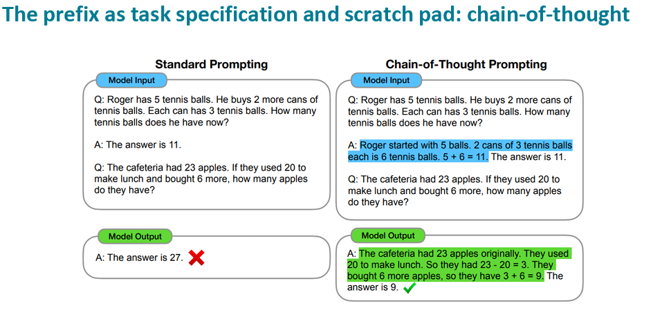

## Chain of Thought Reasoning

While decoder-only models are powerful text generators, they can also exhibit complex reasoning behavior when prompted effectively. One prominent prompting technique is chain of thought (CoT) prompting, which encourages the model to generate intermediate reasoning steps before arriving at a final answer.

Unlike direct answer prompting, CoT decomposes complex problems into step-by-step explanations, aligning better with how the model internally represents procedural and logical information. This is particularly beneficial in tasks such as arithmetic reasoning, commonsense inference, and symbolic manipulation.

### Standard Prompt vs. Chain of Thought Prompt

Consider the task of solving a multi-step math problem. A standard prompt might look like:

> Q: If there are 3 cars and each car has 4 wheels, how many wheels are there in total?  
> A:

A model may correctly answer with `12`, but it might also fail if it tries to answer without reasoning explicitly.

In contrast, a chain of thought prompt elicits intermediate steps:

> Q: If there are 3 cars and each car has 4 wheels, how many wheels are there in total?  
> A: Each car has 4 wheels. There are 3 cars. So the total number of wheels is $3 \times 4 = 12$. The answer is 12.

### Benefits of Chain of Thought Prompting

- Improved accuracy: CoT often leads to significantly higher accuracy on reasoning-heavy tasks, particularly in few-shot or zero-shot settings  
- Interpretable outputs: Intermediate steps provide insights into model behavior, making it easier to debug or assess alignment  
- Alignment with human reasoning: CoT mimics how humans solve problems, which can be useful in educational or assistive applications  

### Model Compatibility

Chain of thought prompting has shown the most benefit in large decoder-only models such as GPT-2 and GPT-4. These models have sufficient capacity to maintain coherent multistep reasoning traces when prompted appropriately.
