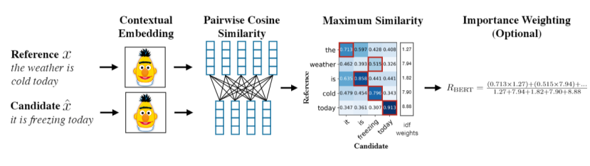

# Evaluating NLG Systems

Evaluation of Natural Language Generation (NLG) systems presents unique challenges due to the open-ended nature of their outputs. Unlike NLU tasks, where there is typically a single correct answer or label, NLG tasks often involve generating long-form text with many plausible outputs. As a result, standard machine learning metrics like accuracy or F1-score are not directly applicable.

In open-ended tasks, the quality of a generation cannot be assessed solely based on correctness, but rather on a spectrum of qualitative dimensions such as fluency, coherence, relevance, and factuality. Multiple responses may be acceptable to varying degrees, making evaluation inherently more subjective.

Common NLG tasks include:

- Summarization: CNN/DailyMail, Gigaword  
- Machine Translation: WMT (Workshop on Machine Translation)  
- Instruction-following and dialogue: Chatbot Arena, AlpacaEval, MT-Bench  

Evaluation of Natural Language Generation (NLG) systems is challenging due to the diverse forms and goals of generated text. Evaluation methods can be categorized into three primary types:

1. Content Overlap Metrics  
2. Model-Based Metrics  
3. Human Evaluations  

## 1. Content Overlap Metrics

These metrics assess the lexical similarity between generated text and reference (gold-standard) outputs. They rely on $n$-gram overlap and are fast, easy to compute, and widely used.

Common Metrics:

- BLEU (Precisiong) - MT  
- ROUGE (Recall) - Summarization  
- METEOR  
- CIDEr  

Limitations:

- Do not account for semantic similarity or paraphrasing.  
- Declining effectiveness with more open-ended tasks:
    - Summarization: Sensitive to lexical variation in longer texts.  
    - Dialogue: Penalizes legitimate, diverse responses.  
    - Story generation: May report high scores due to long-sequence overlap without true quality.  

## 2. Model-Based Metrics

These leverage pretrained neural representations (learned representation) to assess semantic similarity, often with better correlation to human judgments.

### (a) Embedding-Based Metrics

- Embedding Average  
- Vector Extrema  
- Word Mover's Distance (WMD)  
- MEANT  
- YISI  

### (b) Contextual Embedding Metrics

- BERTScore: Uses contextual embeddings from BERT to compute word-level cosine similarity.

- BLEURT: BERT-based regression model fine-tuned to predict human judgment.  
- Sentence Mover's Similarity: Extends WMD to sentence-level embeddings for evaluating coherence.  

### (c) Distributional Metrics

- MAUVE: Computes divergence between the distribution of generated and reference texts in embedding space, interpolating between them. Suited for open-ended tasks.  

## 3. Human Evaluations

Automatic metrics often fail to fully capture generation quality. Human evaluations remain the most reliable and nuanced method.

Evaluation Dimensions:

- Fluency  
- Coherence / Consistency  
- Factual Accuracy  
- Commonsense Reasoning  
- Grammaticality  
- Style and Formality  
- Redundancy  
- Typicality / Appropriateness  

Challenges:

- Expensive and time-consuming  
- Variability across annotators  
- Inconsistent or subjective judgments  
- Human only evaluate precision not recall.  

Best Practices:

- Use standardized scales (e.g., Likert)  
- Report inter-rater agreement  
- Combine with automatic metrics  

## Emerging Trend: LLM-as-Evaluator

### Reference-based Evaluation

This traditional approach compares model-generated text to one or more human-written reference outputs. It assumes the existence of gold-standard references and uses lexical or semantic similarity metrics to assess quality. While effective for tasks like summarization and translation, it struggles with open-ended generation where multiple valid outputs exist.

- Widely used in early NLP benchmarks.  
- Examples: BLEU, ROUGE, METEOR, BERTScore.  

### Reference-free Evaluation

In this approach, model outputs are evaluated without gold references—typically by using another model (or the same model) to assign scores based on perceived quality. This has gained traction with the advent of large instruction-tuned models like GPT-4, which can perform relatively consistent evaluations aligned with human preferences.

- Especially useful for instruction-following or multi-turn dialogue.  
- Examples: AlpacaEval, MT-Bench, Chatbot Arena.  

Recent approaches employ large language models to act as automated evaluators (e.g., G-Eval, GPT-4-as-a-judge), showing promising alignment with human judgments while offering scale and speed.

## Comparison of Evaluation Metrics

| Metric      | Type                    | Semantic Awareness | Best for              |
|------------|-------------------------|--------------------|-----------------------|
| BLEU       | Content overlap         | No                 | Translation           |
| ROUGE      | Content overlap         | Partial            | Summarization         |
| METEOR     | Content overlap         | Partial            | Translation           |
| CIDEr      | Content overlap         | No                 | Image captioning      |
| BERTScore  | Model-based             | Yes                | Summarization, QA     |
| BLEURT     | Model-based             | Yes                | Open-domain gen       |
| MAUVE      | Model-based (dist.)     | Yes                | Long-form gen         |
| Human Eval | Human                   | Yes                | All tasks             |

## Takeaways

- Content overlap metrics are fast but insufficient for evaluating meaning or diversity.  
- Model-based metrics offer semantic insight but can be opaque.  
- Human judgments are indispensable, despite their cost and variability.  
- Inspect model outputs manually—don’t rely on metrics alone.  
- Publicly release model outputs to promote reproducibility and transparency.  
