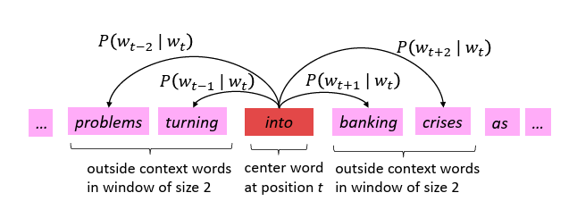

# Chapter 1: NLP an introduction
Natural language processing (NLP) focuses on enabling machines to understand and work with human language. 

At a high level, NLP systems follow a common pipeline: text is first represented numerically, then modeled statistically or with neural networks, and finally evaluated on language tasks. This chapter focuses on the first and most fundamental step—how language is represented.

## Word Representations
Early NLP systems relied on fixed, count-based representations. While simple and interpretable, these approaches struggle to capture deeper semantic relationships, motivating the move toward learned representations.

- One-hot encoding: Represents each word as a sparse vector with a single 1. Fails to capture semantic similarity or relationships between words.

- n-grams: Represent text as sequences of $n$ consecutive words or characters (e.g., bigrams, trigrams). Capture limited context but increase sparsity and dimensionality with higher $n$.

- Bag of Words (BoW): Represents documents by word frequency vectors. Simple and effective, but ignores word order and context.

- TF-IDF (Term Frequency – Inverse Document Frequency): Adjusts raw word counts by penalizing frequent words and highlighting informative ones.
  - TF (term frequency): Measures how often a word appears in a document.
  - IDF (inverse document frequency): Reduces the weight of common words across documents.
  - TF-IDF score for term $t$ in document $d$:
    $$
    \text{TF-IDF}(t, d) = \text{TF}(t, d) \cdot \log\left(\frac{N}{\text{DF}(t)}\right)
    $$
    where $N$ is the total number of documents and $\text{DF}(t)$ is the number of documents containing $t$.

- Co-occurrence Matrix: Counts how often words appear near each other within a context window. Captures word associations but leads to large, sparse matrices.

- Latent Semantic Analysis (LSA): Applies Singular Value Decomposition (SVD) to the co-occurrence matrix to uncover latent semantic dimensions and reduce dimensionality.

## Word2Vec: Learning Word Representations

Word2Vec was one of the first widely successful methods to demonstrate that simple neural objectives, trained at scale, can produce rich semantic representations without explicit supervision.

Goal: Learn word embeddings such that words appearing in similar contexts have similar vector representations.

- Input: Large corpus of text, fixed vocabulary of size $|V|$.
- Output: Two embedding matrices:
  - Input (center) word matrix $W \in \mathbb{R}^{d \times |V|}$
  - Output (context) word matrix $W' \in \mathbb{R}^{d \times |V|}$
- Two main training architectures:

### 1. Skip-gram Model

- Predict context words $w_{t+j}$ given a center word $w_t$, for $-m \le j \le m,\ j \neq 0$.
- Maximize conditional likelihood:
  $$
  \prod_{t=1}^T \prod_{-m \le j \le m,\ j \neq 0} P(w_{t+j} \mid w_t)
  $$
- Softmax formulation:
  $$
  P(o \mid c) = \frac{\exp(\mathbf{v}_o^\top \mathbf{v}_c)}{\sum_{w \in V} \exp(\mathbf{v}_w^\top \mathbf{v}_c)}
  $$
- Challenge: Softmax denominator scales with vocabulary size $|V|$, making training expensive.

### 2. CBOW (Continuous Bag of Words)

- Predict the center word $w_t$ from its surrounding context words.
- Average context embeddings:
  $$
  \hat{\mathbf{v}} = \frac{1}{2m} \sum_{-m \le j \le m,\ j \neq 0} \mathbf{v}_{w_{t+j}}
  $$
- Predict $w_t$ using softmax:
  $$
  P(w_t \mid \text{context}) = \frac{\exp(\mathbf{v}_{w_t}^\top \hat{\mathbf{v}})}{\sum_{w \in V} \exp(\mathbf{v}_w^\top \hat{\mathbf{v}})}
  $$
- Typically faster to train than Skip-gram, and better for frequent words.

Together, Skip-gram and CBOW illustrate two complementary perspectives: predicting context from a word versus predicting a word from its context.

## GloVe: Global Vectors for Word Representation

Unlike Word2Vec, which learns embeddings implicitly through prediction tasks, GloVe makes the statistical structure of language explicit through global co-occurrence counts.

Goal: Capture the meaning of words using statistics of word co-occurrence across the entire corpus.

- While Word2Vec uses local context windows, GloVe (Global Vectors) constructs a global co-occurrence matrix, where $X_{ij}$ is the number of times word $j$ appears near word $i$.
- GloVe seeks to find word vectors $\mathbf{w}_i$, $\tilde{\mathbf{w}}_j$ such that:
  $$
  \mathbf{w}_i^\top \tilde{\mathbf{w}}_j + b_i + \tilde{b}_j = \log(X_{ij})
  $$
- The underlying insight: ratios of co-occurrence probabilities encode meaning. For example, consider how a target word $x$ relates to two context words $a$ and $b$:
  $$
  \frac{P(x \mid a)}{P(x \mid b)} \quad \text{can be modeled as} \quad \mathbf{w}_x^\top (\mathbf{w}_a - \mathbf{w}_b)
  $$
  This shows that linear differences between word vectors reflect meaningful relationships (e.g., $\texttt{king} - \texttt{man} + \texttt{woman} \approx \texttt{queen}$).
- To learn these representations, GloVe minimizes a weighted least squares loss:
  $$
  J = \sum_{i,j=1}^{|V|} f(X_{ij}) \left( \mathbf{w}_i^\top \tilde{\mathbf{w}}_j + b_i + \tilde{b}_j - \log(X_{ij}) \right)^2
  $$
- The weighting function $f(X_{ij})$ ensures that very frequent co-occurrences do not dominate the loss, and very rare ones do not introduce noise. A typical choice:
  $$
  f(X_{ij}) =
  \begin{cases}
  \left(\frac{X_{ij}}{x_{\text{max}}}\right)^\alpha & \text{if } X_{ij} < x_{\text{max}} \\
  1 & \text{otherwise}
  \end{cases}
  $$
  where $\alpha \in [0,1]$, e.g., $\alpha = 0.75$.
- Interpretation: GloVe combines the global statistical strength of matrix factorization (like LSA) with the expressive power of vector differences. This allows it to learn embeddings that perform well on tasks like analogy completion, clustering, and semantic similarity.

Both Word2Vec and GloVe produce static word embeddings, where each word has a single vector regardless of context. While powerful, this assumption will later be revisited with contextualized representations.

## Evaluating Word Vectors: Intrinsic vs. Extrinsic

Because embeddings are intermediate representations rather than end goals, evaluating their quality requires careful consideration of what “good” representations mean in practice.

- Evaluation of word vectors can be divided into intrinsic and extrinsic methods.

### Intrinsic Evaluation

- Tests word vectors on intermediate, well-defined subtasks.
- Fast to compute and useful for understanding specific aspects of embeddings.
- However, it is not always clear if performance on intrinsic tasks translates to improvements in real-world tasks.
- Example: Compute cosine similarity between word pairs and compare with human similarity ratings.

### Extrinsic Evaluation

- Measures performance on a real downstream NLP task.
- Slower and more expensive to compute but provides more practical insight.
- Hard to isolate whether improvements are due to the word vectors or other parts of the system.
- Example: Use word embeddings in a Named Entity Recognition (NER) system and evaluate changes in accuracy.
- If replacing one embedding model with another improves end-task performance, the new model is considered better.

This chapter establishes the foundational idea that representation learning lies at the heart of modern NLP, setting the stage for deeper neural architectures and contextual language models explored in later chapters.
