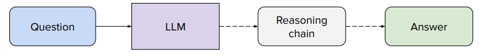

# Reasoning

## What Do We Mean by “Reasoning”?

Reasoning is the disciplined use of facts and logic to reach new conclusions.

Reasoning  = Ability to solve a problem.

- Deductive reasoning derives conclusions that must be true if the premises are true.
- Inductive reasoning generalises from repeated observations to predict what is likely to hold in future.
- Abductive reasoning infers the most plausible explanation for an observation (“inference to the best explanation”).

## Reasoning in Large Language Models (LLMs)

Large language models excel at predicting the next token given a context — essentially a massively multivariate pattern-completion task. Whether this *is* reasoning is an open research question, but several techniques reliably elicit reasoning-like behavior.

### Prompt Engineering

- Chain-of-Thought (CoT) prompts append reasoning demonstrations (e.g., "Let's think step-by-step") to encourage the model to reveal latent intermediate states. 
- Least-to-Most (LtM) decomposition breaks a hard task into a sequence of smaller sub‑problems; the LLM solves each sub‑problem in order, reducing error accumulation. 

### Counterfactual Probes

By editing premises and comparing completions, researchers can distinguish memorisation from real generalisation: if the model’s answer tracks the counterfactual change, it has formed some causal abstraction rather than merely retrieving training data.

### Limitations

- Current LLMs have no explicit logical machinery or world model; apparent ``logic`` emerges from statistical correlations. 

- Faithfulness is not guaranteed: the model may generate fluent but incorrect reasoning chains (hallucinations).

-  Working memory is finite, so long multi‑step proofs can overflow the context window unless external scratchpads or tool use are provided.

### How to Incentivize model to reason before answering?

- Avoid relying on human-written reasoning traces as supervision: collecting long, correct chains by hand is costly, slow, and does not scale. We also do not want to cap the model at human reasoning ability.

- Elicit reasoning implicitly rather than prescribe it explicitly: prompts like CoT or LtM encourage the model to reason without restricting it to human-authored logic.

- Train using outcome-based rewards instead of process imitation: reward the model only on whether it solved the problem correctly, not on whether its reasoning resembles a human chain.

- Use verifiable, binary feedback when possible (“Did the solution work?” → yes/no). This creates a natural, scalable reward signal for reinforcement learning without requiring ground-truth reasoning paths.

- Leverage external memory or tools for long reasoning: scratchpads, code execution, or symbolic solvers prevent context overflow and let the model learn to reason in structured ways when needed.

- SReinforce generalization through counterfactual consistency: if answers change appropriately when premises are edited, the model is likely forming causal abstractions rather than retrieving memorized patterns.

## GRPO: Reasoning via Relative Outcome-Based RL
GRPO is a reinforcement learning algorithm introduced by DeepSeek that adapts PPO to operate on groups of sampled outputs, optimizing policies using relative advantages within a batch rather than an external critic model.

Group Relative Policy Optimization (GRPO) reframes policy learning from *"how good is this answer?"* to:

> "Is this answer better than other answers the model itself could have produced for the same problem?"

Instead of learning an absolute value function (critic), GRPO computes relative advantage across a small group of model-sampled responses, creating a self-normalizing learning signal based purely on outcome rewards.

This works well for reasoning tasks because:
- we do not supervise reasoning chains
- we evaluate only final correctness
- improvement requires the model to invent internal reasoning strategies

### Policy Gradient with Group-Relative Advantage

For a prompt $x$, the model samples a group of $G$ answers $y_1, ..., y_G$ from its policy $\pi_\theta$.

Each answer receives a verifiable outcome reward $r_i$.

The group-relative advantage is:

$
A_i = \frac{r_i - \mu_G}{\sigma_G}
$

where:

- $ \mu_G = \frac{1}{G} \sum_{j=1}^{G} r_j $ (group mean reward)  
- $ \sigma_G = \sqrt{\frac{1}{G} \sum_{j=1}^{G} (r_j - \mu_G)^2} $ (group reward standard deviation)

Implications:

- $A_i > 0$ → answer is better than the model’s average attempt → increase its probability
- $A_i < 0$ → worse than average → decrease its probability
- If all $r_i$ are equal ($\sigma_G \approx 0$), the update is suppressed → noisy gradients avoided

The policy gradient direction becomes:

$
\nabla_\theta \mathcal{L} = - \frac{1}{G} \sum_{i=1}^{G} A_i \nabla_\theta \log \pi_\theta(y_i | x)
$

So the model learns to make above-average answers more likely than below-average ones, using only outcomes.

### Implementation

A typical GRPO loop conceptually involves:

1. Sampling multiple answers per question  → encourages strategy diversity
2. Scoring final answers via an automatic verifier  → binary correctness or deterministic grading
3. Computing advantages relative to other sampled answers
4. Updating the model to prefer better-than-average answers
5. Iterating across many prompts  → gradually shifting toward answers that are consistently stronger than the model’s own alternatives, which requires real reasoning improvements

