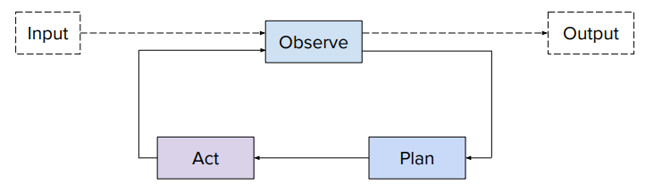

# Agents

An agent is an autonomous system that pursues goals and completes tasks on behalf of a user, often by combining reasoning, planning, and external tool interaction.

## ReAct: Reason + Act

ReAct is a framework for interleaving reasoning and action:

- Reason:  
    - Synthesize previous actions and observations  
    - Explicitly represent what is currently known, including the agent’s own knowledge  
    - Perform reasoning-heavy steps to determine the next necessary action  

- Plan:  
    - Break down the goal into discrete tasks  
    - Decide which tools or APIs need to be invoked for each task  

- Act:  
    - Execute actions via APIs or external tools  
    - Query databases, knowledge bases, or documents for required information  
    - Generate outputs that move the system closer to the goal  

This iterative loop of Reason → Plan → Act allows agents to handle complex, multi-step tasks while adapting to new information.

## Agent-to-Agent (A2A) Communication

A2A enables multiple agents to collaborate or delegate tasks within a system:

- AgentSkill: Encapsulated capabilities or specialized functions that an agent can perform  
- AgentCard: Metadata describing an agent’s skills, responsibilities, and state  
- AgentExecutor: Core component that orchestrates task execution, coordinates between agents, and manages action flow  

A2A frameworks facilitate scalable, modular, and cooperative agent ecosystems, where complex tasks are distributed across specialized agents for efficiency and robustness.
