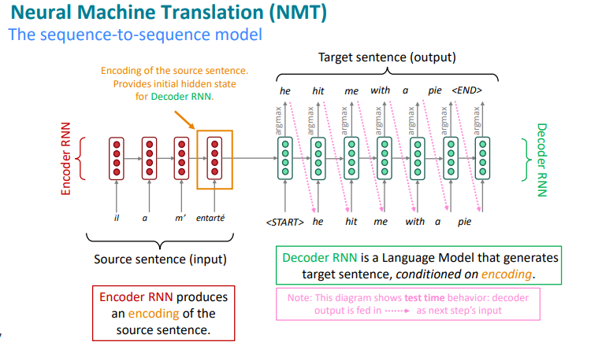

# Chapter 6: Application of RNNs
Recurrent neural networks are particularly well suited for tasks involving sequential structure, where predictions depend on both current input and past context.

1. Part-of-Speech Tagging and Named Entity Recognition

These are sequence labeling tasks where each word in a sentence is assigned a tag. An RNN processes the input word sequence one token at a time and produces an output tag for each time-step. In these tasks, the output sequence has the same length as the input sequence.

- Input: A sequence of word vectors $(x_1, x_2, \dots, x_T)$  
- Architecture: A unidirectional RNN (e.g., vanilla RNN, LSTM, or GRU) computes hidden states $(h_1, h_2, \dots, h_T)$  
- Output: Each $h_t$ is passed through a softmax classifier to predict a tag $y_t$ for the corresponding word  

Bidirectional RNNs are also commonly used in practice, as tag predictions often depend on both left and right context.

 
2. Sentiment Analysis
Unlike sequence labeling, sentiment analysis produces a single label for the entire sequence.
This is a sequence classification task where the entire input sequence is mapped to a single output label (e.g., positive or negative sentiment).

- Input: A sequence of word vectors $(x_1, x_2, \dots, x_T)$  
- Architecture: A bidirectional RNN (BiRNN) is commonly used to capture both past and future context. Hidden states from both directions $(\overrightarrow{h_t}, \overleftarrow{h_t})$ are concatenated  
- Output: All hidden states are typically aggregated (e.g., by mean pooling, attention, or taking the final state), then passed through a feedforward layer and softmax for classification. Aggregation converts a variable-length sequence of hidden states into a fixed-dimensional representation suitable for classification.

Note: Bidirectional architectures often yield better performance in sentiment tasks because sentiment cues may appear anywhere in the sequence and depend on both preceding and following words.

 
3. Multi-layer RNNs

Stacking multiple RNN layers allows the model to learn increasingly abstract representations of the input sequence, similar to how deeper CNNs or MLPs work in vision and other tasks. Each layer processes the full sequence, allowing higher layers to operate on representations produced by lower layers.

- Lower layers: Learn low-level features (e.g., short-range dependencies or local syntax)  
- Higher layers: Learn high-level abstractions (e.g., semantics, global structure)  

 
4. Seq-to-seq
Some tasks require transforming one sequence into another sequence of different length.

- Sequence-to-sequence models are based on the encoder-decoder architecture  
- The encoder processes the input sequence into a fixed-length neural representation  
- The decoder generates the output sequence from this encoded representation  
- When both the input and output are sequences, the model is referred to as a seq2seq model  

Early seq2seq models rely on a fixed-length encoded representation, which can limit performance on long sequences.

Applications of sequence-to-sequence models beyond machine translation:

- Summarization: Long documents $\rightarrow$ short summaries  
- Dialogue generation: Previous utterances $\rightarrow$ next response  
- Syntactic parsing: Input text $\rightarrow$ parse tree (as a sequence)  
- Code generation: Natural language $\rightarrow$ source code (e.g., Python)  

These applications illustrate how RNNs can be adapted to a wide range of sequence modeling problems by varying the architecture and output structure.