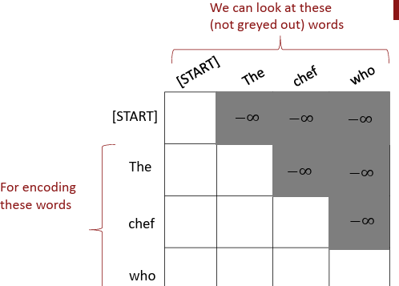
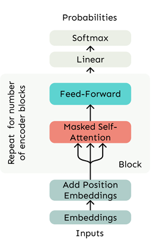

## Self-Attention and Transformers

This chapter explains how self-attention addresses the core limitations of recurrent architectures and forms the foundation of Transformer models.

## Limitations of Recurrent Models: Linear Interaction Distance

Recurrent neural networks (RNNs) process input sequences sequentially, typically from left to right. This enforces a form of linear locality, which reflects the useful heuristic that nearby words often influence each other's meanings. However, this sequential structure introduces several key limitations:

- Inefficient long-range dependencies: For two tokens separated by $n$ positions, RNNs require $O(n)$ steps for information to propagate between them. This makes it difficult to model long-distance dependencies, as the gradient signal must traverse many time steps, leading to vanishing or exploding gradients. Even in gated variants such as LSTMs and GRUs, this remains a practical bottleneck.

- Hardcoded sequential bias: The linear order of token processing is baked into the architecture. However, natural language often exhibits hierarchical or non-sequential structure that is not well captured by strictly left-to-right modeling.

- Limited parallelization: The computation of each hidden state depends on the previous one. Both forward and backward passes involve $O(n)$ inherently sequential operations, preventing full utilization of modern parallel computing hardware such as GPUs.

- Scalability challenges: Due to the sequential nature of training, RNNs are slower to train on large datasets and harder to scale to deep architectures.

These issues stem from the requirement that information must pass through a chain of intermediate states. These limitations motivate the development of alternative architectures. In particular, self-attention mechanisms, as introduced in the Transformer model, allow each token to attend to all others directly in a single logical step, enabling efficient modeling of long-range dependencies and highly parallelizable computation.

## Attention Mechanisms

Attention mechanisms enable each word in a sentence to dynamically incorporate information from other words. At a high level, attention treats each word’s representation as a query that retrieves and integrates information from a set of key-value pairs derived from the same or another sequence. In self-attention, queries, keys, and values are all derived from the same input sequence.

Unlike recurrent models, attention does not rely on sequential processing. This leads to two key computational benefits:

- Constant logical interaction distance: Any token can attend to any other token within a sentence in a single logical step, making the maximum dependency path $O(1)$. However, the actual computational cost remains $O(n^2)$ due to pairwise interactions.

- Fully parallelizable: Since all token interactions can be computed simultaneously, the number of sequential (unparallelizable) operations does not grow with sequence length.

From encoder-decoder to self-attention.  
In earlier encoder-decoder models (e.g., for machine translation), attention was applied from the decoder to the encoder, allowing the decoder to selectively focus on parts of the input sequence. In self-attention, we apply the same mechanism within a single sequence, allowing each word to attend to every other word in the same sequence.

Attention as soft lookup.  
Conceptually, attention can be viewed as a soft, weighted lookup in a key-value store. Each query computes a similarity score with every key, producing a weight (typically via softmax). The output is a weighted average of the values:

$$
\text{output} = \operatorname{softmax}\!\left(\frac{QK^\top}{\sqrt{d_k}}\right) V
$$

## Self-Attention: Computing Contextual Representations

Let $\mathbf{w}_{1:n}$ be a sequence of token indices. Each token $\mathbf{w}_i$ is mapped to an embedding vector $\mathbf{x}_i \in \mathbb{R}^d$ using an embedding matrix $E \in \mathbb{R}^{d \times |V|}$.

For each input vector $\mathbf{x}_i$, we compute three linear projections:

$$
\mathbf{q}_i = Q \mathbf{x}_i, \quad
\mathbf{k}_i = K \mathbf{x}_i, \quad
\mathbf{v}_i = V \mathbf{x}_i
$$

where:

- $Q, K, V \in \mathbb{R}^{d_a \times d}$ are learnable projection matrices  
- $d$ is the input embedding dimension  
- $d_a$ is the dimension of the attention subspace (often $d_a = d / h$ for $h$ heads)

The dot product of $\mathbf{q}_i$ and $\mathbf{k}_j$ determines how much token $i$ attends to token $j$:

$$
e_{ij} = \frac{\mathbf{q}_i^\top \mathbf{k}_j}{\sqrt{d_a}},
\quad
\alpha_{ij} = \text{softmax}_j(e_{ij})
$$

The scaling factor $\sqrt{d_a}$ stabilizes gradients by preventing dot products from growing too large.

$$
\mathbf{o}_i = \sum_{j=1}^n \alpha_{ij} \mathbf{v}_j
$$

Each token’s output $\mathbf{o}_i$ is a weighted sum of the value vectors from all tokens, where the weights are determined by how similar their keys are to the query. Each output vector therefore represents the token in the context of the entire sequence.

Multi-head attention.  
Instead of one set of $Q, K, V$, Transformers use $h$ sets to learn diverse patterns. Each head uses its own set of $Q_h, K_h, V_h \in \mathbb{R}^{d_h \times d}$ with $d_h = d / h$, and their outputs are concatenated:

$$
\text{MultiHead}(X)
=
\text{Concat}(\mathbf{o}_i^{(1)}, \dots, \mathbf{o}_i^{(h)}) W^O,
\quad
W^O \in \mathbb{R}^{d \times d}
$$

Using multiple heads allows the model to attend to different types of relationships, such as syntax, coreference, or positional patterns.

## Nonlinearities and the Role of Feed-Forward Networks
Attention mixes information across tokens, while feed-forward networks transform information within each token. Note that the self-attention mechanism itself is linear with respect to the input embeddings. There are no activation functions inside the attention computation. Stacking more self-attention layers only re-averages and mixes value vectors.

To introduce nonlinearity and enable richer representations, each Transformer block includes a position-wise feed-forward network applied independently to each token:

$$
\text{FFN}(\mathbf{o}_i)
=
W_2 \cdot \text{ReLU}(W_1 \cdot \mathbf{o}_i + \mathbf{b}_1) + \mathbf{b}_2
$$

where:

- $W_1 \in \mathbb{R}^{d_{\text{ff}} \times d}$ and $W_2 \in \mathbb{R}^{d \times d_{\text{ff}}}$ are learnable parameters  
- $d_{\text{ff}}$ is typically larger than $d$

This nonlinear transformation enhances the model's capacity and expressiveness.

## Masking the Future in Self-Attention

In autoregressive tasks such as language modeling or machine translation decoding, the model must not attend to future tokens.

Naive approach (inefficient).  
At each time step $i$, compute attention using only tokens $1$ through $i$. This requires sequential recomputation and defeats parallelization.

Efficient approach: causal masking.  
Full attention scores are computed, but future tokens are masked by setting their logits to $-\infty$:

$$
e_{ij} =
\begin{cases}
\frac{\mathbf{q}_i^\top \mathbf{k}_j}{\sqrt{d_a}}, & j \le i \\
-\infty, & j > i
\end{cases}
$$

This causes $\alpha_{ij} = 0$ for future positions while preserving parallel computation.

Effect: Prevents information from future tokens from leaking into past representations while enabling efficient training.

## Positional Encoding in Self-Attention

Since attention is content-based, it is insensitive to token positions unless position information is added.

Absolute positional encoding.  
Positional vectors $\mathbf{p}_i$ are added to the input embeddings:

$$
\tilde{\mathbf{x}}_i = \mathbf{x}_i + \mathbf{p}_i
$$

Sinusoidal (fixed) vs learned (trainable):

- Sinusoidal:
$$
\mathbf{p}_i^{(2k)} = \sin(i / 10000^{2k/d}),
\quad
\mathbf{p}_i^{(2k+1)} = \cos(i / 10000^{2k/d})
$$

- Learned: Each position has a trainable vector

Relative and rotary positional encodings:

- Relative: Represent relative distance between tokens  
- Rotary (RoPE): Rotate queries and keys in complex space to encode position  

These methods improve generalization to longer contexts and are used in modern architectures such as LLaMA and Transformer-XL.

## Necessities for a Self-Attention Building Block

- Self-attention: the core mechanism  
- Position representations: specify sequence order since self-attention is permutation-invariant  
- Nonlinearities: applied after self-attention, typically via feed-forward networks  
- Masking: prevents future information leakage while enabling parallel computation  

Together, these components define a complete and scalable self-attention building block.

Stacking these blocks yields the Transformer architecture, which has become the dominant model for modern natural language processing.

## Sequence-Stacked and Multi-Headed Attention
This section reformulates self-attention in matrix form and extends it to multi-head attention, which is the core computational unit of Transformer layers.

### Matrix formulation of self-attention

Self-attention allows each token in a sequence to attend to every other token, enabling contextual representation learning. Let $X = [x_1, \dots, x_n] \in \mathbb{R}^{n \times d}$ be the input sequence of $n$ token embeddings, where $d$ is the embedding dimension. Each row $x_i \in \mathbb{R}^d$ corresponds to the $i$-th token. We compute projections of the input to obtain the query, key, and value matrices:

$$
Q = X W_Q, \quad K = X W_K, \quad V = X W_V
$$

where $W_Q, W_K, W_V \in \mathbb{R}^{d \times d_k}$ are learned projection matrices, and  
$Q, K, V \in \mathbb{R}^{n \times d_k}$ are the resulting matrices of projected queries, keys, and values.

This matrix formulation allows attention to be computed for all tokens simultaneously using efficient linear algebra operations.

Interpretation of dimensions:

- $n$: number of tokens in the input sequence  
- $d$: original token embedding dimension  
- $d_k$: dimensionality of projected query, key, and value vectors  
- $Q_{i\cdot}, K_{j\cdot} \in \mathbb{R}^{d_k}$: the query vector for token $i$ and the key vector for token $j$  

### Scaled dot-product attention
Attention scores are computed using scaled dot-products between queries and keys:

$$
S = \frac{Q K^\top}{\sqrt{d_k}} \in \mathbb{R}^{n \times n}
$$

The matrix $S$ therefore contains all pairwise token interactions in the sequence. Each entry $S_{ij}$ represents the unnormalized attention score from token $i$ to token $j$. The division by $\sqrt{d_k}$ stabilizes gradients by preventing dot products from becoming too large in high dimensions. A row-wise softmax is applied to $S$ to produce attention weights, which are then used to compute a weighted sum of the value vectors:

$$
\text{Attention}(Q, K, V)
=
\text{softmax}\!\left( \frac{Q K^\top}{\sqrt{d_k}} \right) V
\in \mathbb{R}^{n \times d_k}
$$

This formulation enables fully parallelizable all-to-all interactions between tokens in a single matrix operation. 

While single-head attention can model dependencies, it is limited to a single representation subspace.

### Multi-head self-attention.  
Single-head attention captures a single type of interaction. To disentangle different kinds of linguistic relationships such as syntactic structure, semantic similarity, or positional alignment, Transformers use multi-head attention, which computes multiple attention distributions in parallel.

Let $h$ be the number of attention heads. For each head $\ell \in \{1, \dots, h\}$, the input  
$X \in \mathbb{R}^{n \times d}$ is projected into separate subspaces using head-specific learned matrices:

$$
Q_\ell = X W_{\ell Q}, \quad
K_\ell = X W_{\ell K}, \quad
V_\ell = X W_{\ell V},
$$

where $W_{\ell Q}, W_{\ell K}, W_{\ell V} \in \mathbb{R}^{d \times d_h}$ and $d_h = d / h$, ensuring that total computational cost remains comparable to single-head attention.

Each head computes its own scaled dot-product attention:

$$
\text{head}_\ell
=
\text{softmax}\!\left( \frac{Q_\ell K_\ell^\top}{\sqrt{d_h}} \right) V_\ell
\in \mathbb{R}^{n \times d_h}
$$

The outputs of all heads are then concatenated and linearly transformed to produce the final result:

$$
\text{MultiHead}(X)
=
\text{Concat}(\text{head}_1, \dots, \text{head}_h) W^O,
\quad
W^O \in \mathbb{R}^{d \times d}
$$

The output combines multiple perspectives on the sequence, each capturing different relational patterns.

### Implementation efficiency
Despite computing multiple attention heads, multi-head attention is efficient in practice. Once the projections $Q$, $K$, and $V$ are computed jointly for all heads, the resulting tensors are reshaped into $(n, h, d_h)$ and then transposed to $(h, n, d_h)$ to enable batched attention computation across heads. Treating the head index as an additional batch dimension allows highly optimized parallel execution.

Summary: Multi-head attention provides rich modeling capacity by enabling the network to focus on different parts of the sequence using separate learned subspaces. Each head attends to different contextual signals, and their combination offers a composite, expressive representation that is crucial for modeling complex dependencies in natural language.

## Optimization Tricks – Add & Norm

The Transformer uses the multi-head self-attention mechanism introduced earlier. To ensure better training dynamics and convergence, it incorporates two critical optimization components in each block:

- Residual connections  
- Layer normalization  

These operations are often summarized as Add & Norm, since they occur together at every sublayer.

### Residual Connections

Residual (or skip) connections help mitigate the vanishing gradient problem and make deep networks easier to train.  Instead of applying a transformation layer directly to the input:

$$
\mathbf{x}^{(i)} = \text{Layer}(\mathbf{x}^{(i-1)})
$$

we instead compute:

$$
\mathbf{x}^{(i)} = \mathbf{x}^{(i-1)} + \text{Layer}(\mathbf{x}^{(i-1)})
$$

This formulation learns only the residual between the input and the output, which often makes optimization easier. Key benefits include:

- Stable gradients: the gradient through the residual path is exactly 1, which improves backpropagation through deep networks  
- Bias toward the identity function: encourages the model to retain information from earlier layers when deeper transformations are unnecessary  

In Transformers, residual connections are applied around both the self-attention sublayer and the feed-forward sublayer.

### Layer Normalization

Layer normalization improves training speed and stability by standardizing intermediate representations. Given a vector $\mathbf{x} \in \mathbb{R}^d$, layer normalization computes:

$$
\mu = \frac{1}{d} \sum_{j=1}^{d} x_j,
\quad
\sigma = \sqrt{ \frac{1}{d} \sum_{j=1}^{d} (x_j - \mu)^2 }
$$

The normalized output is then:

$$
\text{LayerNorm}(\mathbf{x})
=
\frac{\mathbf{x} - \mu}{\sigma + \epsilon} \odot \gamma + \beta
$$

where:

- $\gamma \in \mathbb{R}^d$ is a learnable gain parameter  
- $\beta \in \mathbb{R}^d$ is a learnable bias parameter  
- $\epsilon$ is a small constant for numerical stability  

The normalization is applied along the feature dimension independently for each token. This reduces internal covariate shift and stabilizes training.

Unlike batch normalization, layer normalization does not depend on batch statistics and is therefore well suited for sequence models.

Together, multi-head attention, residual connections, and layer normalization form the backbone of modern Transformer architectures.